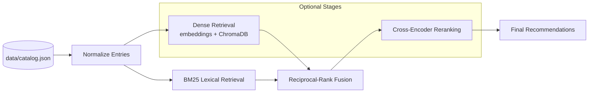
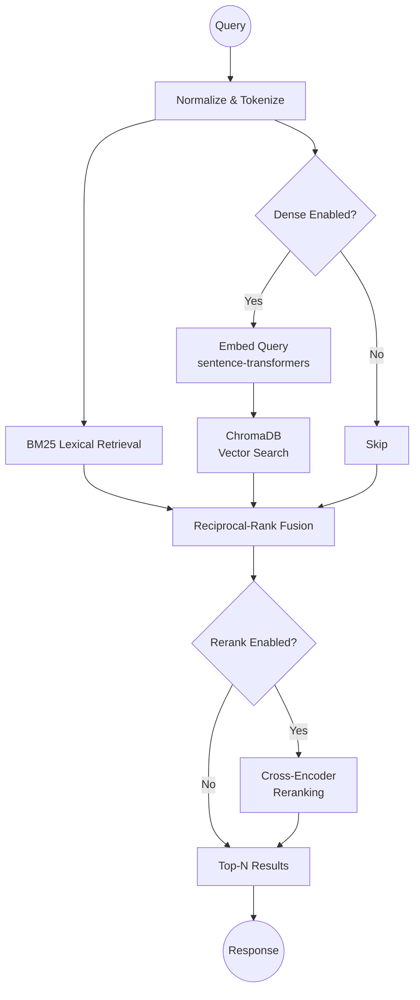

<div align="center">

# 🎯 AssessQ — Assessment Recommender

*Catalog-first recommender for SHL-style assessment batteries — fast lexical retrieval with optional dense embeddings and cross-encoder reranking.*

[](https://opensource.org/licenses/MIT)
[](https://www.python.org/)
[](https://streamlit.io/)
[](https://github.com/dorianbrown/rank_bm25)
[](https://www.trychroma.com/)

</div>

---

## Table of Contents

- [Introduction](#introduction)
- [Core Features](#core-features)
- [Pipeline Architecture](#pipeline-architecture)
- [Retrieval Flow](#retrieval-flow)
- [Tech Stack](#tech-stack)
- [Quick Start](#quick-start)
- [Usage](#usage)
  - [Streamlit UI](#streamlit-ui)
  - [CLI](#cli)
- [CLI Reference](#cli-reference)
- [Output Formats](#output-formats)
- [Project Structure](#project-structure)
- [Contributing](#contributing)
- [License](#license)

---

## Introduction

**AssessQ** is a lightweight, pragmatic assessment recommender built around a **single authoritative catalog** — `data/catalog.json`.

Query a job description. Get a ranked shortlist of assessments.  
Simple on the surface — **precise retrieval underneath.**

No graph-RAG. No over-engineering. Just clean catalog metadata + smart ranking.

---

## Core Features

- **Catalog Normalization** — structured ingestion and normalization of assessment metadata
- **BM25 Lexical Retrieval** — fast, dependency-light candidate generation
- **Dense Retrieval** *(optional)* — sentence-transformer embeddings stored and queried via ChromaDB
- **Reciprocal-Rank Fusion** — combines lexical + dense signals into a unified ranking
- **Cross-Encoder Reranking** *(optional)* — final precision pass over top candidates
- **Streamlit Chat UI** — interactive shortlisting with session-state follow-ups
- **CLI** — scripted, one-shot recommendations with table or JSON output

---

## Pipeline Architecture

The AssessQ pipeline is a modular retrieval stack. Each stage is independently toggleable — run lightweight BM25-only for speed, or enable the full pipeline for maximum precision.



---

## Retrieval Flow

AssessQ routes each query through up to five stages, fusing signals where available:



---

## Tech Stack

| Component | Technology |
|---|---|
| **Lexical Retrieval** | BM25 (`rank_bm25`) |
| **Dense Retrieval** | sentence-transformers + ChromaDB |
| **Reranking** | Cross-encoder model |
| **Fusion** | Reciprocal-Rank Fusion (RRF) |
| **UI** | Streamlit |
| **CLI** | Python (`argparse`) |
| **Catalog** | JSON (`data/catalog.json`) |
| **Evaluation** | Custom harness (`evaluate.py`) |

---

## Quick Start

### 1. Clone & Install

```bash
git clone https://github.com/your-org/assessq.git
cd assessq

# Lightweight — BM25 only (no heavy ML dependencies)
pip install -r requirements.txt
```

### 2. (Optional) Full Pipeline

```bash
# Enables dense retrieval + cross-encoder reranking
pip install -r requirements-full.txt
```

### 3. Run the UI

```bash
streamlit run app.py
```

### 4. Or use the CLI

```bash
python agent.py "Senior backend engineer with Core Java, Spring, SQL, AWS" --top-n 5 --table
```

---

## Usage

### Streamlit UI

```bash
streamlit run app.py
```

The UI maintains the active shortlist in `st.session_state`, enabling conversational refinement. Follow up naturally — for example:

> *"Drop REST and add AWS and Docker"*

No need to restart the query. The session persists your shortlist across turns.

### CLI

**Basic — lexical only (BM25):**

```bash
python agent.py "healthcare admin HIPAA medical terminology word" \
  --languages "English (USA)" \
  --table
```

**Full pipeline — dense + rerank:**

```bash
python agent.py "Senior backend engineer with Core Java, Spring, SQL, AWS, and Docker" \
  --top-n 7 \
  --table \
  --dense \
  --rerank
```

---

## CLI Reference

| Flag | Type | Description |
|---|---|---|
| `--top-k` | `int` | Candidates retrieved before reranking |
| `--top-n` | `int` | Final recommendations returned |
| `--job-levels` | `str` | Comma-separated job level filter |
| `--test-types` | `str` | Comma-separated SHL test type filter (e.g. `K,S,P`) |
| `--languages` | `str` | Comma-separated language filter |
| `--remote-testing` | `bool` | Filter by remote availability (`true` / `false`) |
| `--dense` | flag | Enable ChromaDB + embedding retrieval |
| `--rerank` | flag | Enable cross-encoder reranking |
| `--table` | flag | Output as a markdown table |

---

## Output Formats

**`--table`** — formatted markdown table:

| # | Name | Test Type | Keys | Duration | Languages | URL |
|---|---|---|---|---|---|---|
| 1 | ... | ... | ... | ... | ... | ... |

**Default** — full JSON metadata for each selected assessment.

---

## Project Structure

```
assessq/
├── data/
│   └── catalog.json        # Canonical assessment catalog (single source of truth)
├── app.py                  # Streamlit chat UI
├── agent.py                # CLI entrypoint + retrieval pipeline
├── evaluate.py             # Evaluation harness and utilities
├── requirements.txt        # Lightweight deps (BM25 only)
├── requirements-full.txt   # Full pipeline deps (embeddings + reranker)
└── README.md
```

---

## Contributing

Contributions are welcome. Please follow these guidelines:

1. **Open an issue first** to discuss significant changes before submitting a PR.
2. **Keep PRs focused** — one feature or fix per pull request.
3. **Catalog changes** — if you add new fields to `data/catalog.json`, include a migration or normalization step in the same PR.
4. **Tests** — add or update relevant tests in `evaluate.py` where applicable.
5. **Clear descriptions** — explain the what and why in your PR.

---

## License

See the repository root for licensing details.

---

<div align="center">

*Inspired by [CFOBuddy](https://github.com/caffeicsatyam/CFOBuddy) — thank you for the reference.*

</div>